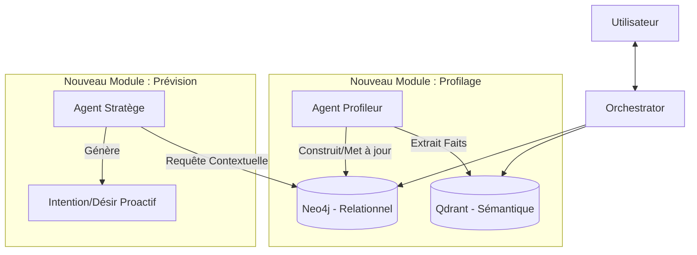

# Rapport d'Analyse et de Conception : Système de Profilage Cognitif Avancé pour Calcifer

## 1. Analyse de l'Existant (ARCOS)

L'architecture actuelle de Calcifer (Projet ARCOS) est modulaire et robuste, reposant sur des bases solides :
*   **Mémoire Long Terme (Vectorielle)** : Utilisation de **Qdrant** pour stocker les souvenirs (`MemoryEntry`), opinions (`OpinionEntry`) et désirs (`DesireEntry`). Cela permet une recherche sémantique efficace.
*   **Personnalité Dynamique** : Le cycle **Mémoire -> Opinion -> Désir** géré par le `PersonalityOrchestrator` et le `DesireService` offre une belle "vie intérieure".
*   **Stack Technique** : Spring Boot 3.5.3, Java 21, et Spring AI 1.0.0 sont des choix modernes et performants.
*   **Limites Actuelles** :
    *   **Réactivité vs Proactivité** : Le système est principalement réactif. Les désirs émergent souvent en réaction à une opinion formée sur un souvenir *passé*. La proactivité "pure" (anticipation) est limitée.
    *   **Modèle Utilisateur Implicite** : Les préférences de l'utilisateur sont diluées dans la masse des souvenirs vectoriels. Il n'y a pas de structure "Cerveau" qui connait explicitement les habitudes, les goûts ou l'emploi du temps de l'utilisateur de manière structurée.
    *   **Manque de Contexte Temporel/Relationnel** : Le vecteur capture le *sens* mais capture mal les relations logiques strictes ou les récurrences temporelles (ex: "Il boit toujours du café à 8h00").

## 2. Proposition : Le Système "GraphMind" (GraphRAG)

Pour répondre à la demande d'un système proactif et apprenant, je propose l'intégration d'une couche **GraphRAG (Retrieval Augmented Generation via Knowledge Graph)**.

L'idée est de compléter la mémoire *floue/sémantique* (Qdrant) par une mémoire *structurée/logique* (Neo4j).

### Architecture Cible



### Les Composants Clés

#### A. Le Knowledge Graph (Neo4j)
Nous allons modéliser l'utilisateur via un graphe.
*   **Noeuds** : `User`, `Concept` (ex: Café, Code, Sport), `TimePattern` (ex: Matin, Week-end), `Location`.
*   **Relations** : `LIKES`, `DISLIKES`, `DOES_AT`, `NEEDS`, `HAS_GOAL`.
*   *Exemple* : `(User) -[LIKES {intensity: 0.9}]-> (Café) -[CONSUMED_AT]-> (Matin)`

#### B. Le "Profiler" (Agent d'Apprentissage Continu)
C'est un service d'arrière-plan qui s'active après chaque conversation significative.
1.  **Extraction** : Il analyse les derniers échanges.
2.  **Structuration** : Il utilise le LLM pour extraire des triplets (Sujet, Prédicat, Objet).
3.  **Consolidation** : Il met à jour le Graphe. Si l'utilisateur dit "J'arrête le café", le lien `LIKES` vers `Café` est affaibli ou supprimé.

#### C. Le "Predictor" (Moteur de Proactivité)
C'est une tâche planifiée (Cron) qui tourne régulièrement.
1.  **Contextualisation** : "Quelle heure est-il ? Quel jour ? Quelle est l'humeur actuelle ?"
2.  **Graph Query** : Il interroge Neo4j pour trouver des nœuds pertinents au contexte actuel (ex: Qu'est-ce que l'utilisateur fait habituellement le *Lundi Matin* ?).
3.  **Génération de Désir** : Si une forte corrélation est trouvée, il injecte un `DesireEntry` proactif dans le système (ex: "Proposer de l'aide pour la revue de code du lundi").

## 3. Plan d'Implémentation Technique

### Étape 1 : Infrastructure
Ajout de **Neo4j** au `docker-compose.yml`.
```yaml
  neo4j:
    image: neo4j:5.15.0
    container_name: arcos_graph
    environment:
      - NEO4J_AUTH=neo4j/password
    ports:
      - "7474:7474"
      - "7687:7687"
```

### Étape 2 : Dépendances Spring
Ajout de `spring-boot-starter-data-neo4j` dans le `pom.xml`.

### Étape 3 : Module `UserModelling`
Création d'un nouveau package `com.arcos.usermodelling` contenant :
*   **Entities** : `GraphNode`, `GraphRelation`.
*   **Service** : `UserGraphService` pour interagir avec Neo4j.
*   **LLM Tools** : `GraphExtractor` (Prompt spécifique pour transformer le texte en triplets).

### Étape 4 : Intégration au Cycle de Vie
*   Modifier `PersonalityOrchestrator` pour appeler le `Profiler` de manière asynchrone après `processMemory`.
*   Créer un `ProactiveScheduler` qui appelle le `Predictor` toutes les X minutes.

## 4. Avantages de cette Solution

1.  **Précision** : Contrairement au vecteur qui devine "à peu près", le graphe sait "exactement". Si le graphe dit `User -[ALLERGIC_TO]-> Peanuts`, Calcifer ne fera jamais l'erreur.
2.  **Explicabilité** : On peut visualiser le graphe pour comprendre pourquoi Calcifer pense que l'utilisateur aime X.
3.  **Évolutivité** : Le graphe peut s'enrichir indéfiniment sans "oublier" les faits anciens (problème fréquent des context windows limitées).
4.  **GraphRAG** : Lors d'une question complexe, Calcifer peut faire une recherche hybride : Vecteur (Concepts similaires) + Graphe (Relations logiques) pour une réponse ultra-pertinente.

C'est une évolution majeure qui transforme Calcifer d'un "chatbot avec mémoire" en un véritable "compagnon cognitif".
